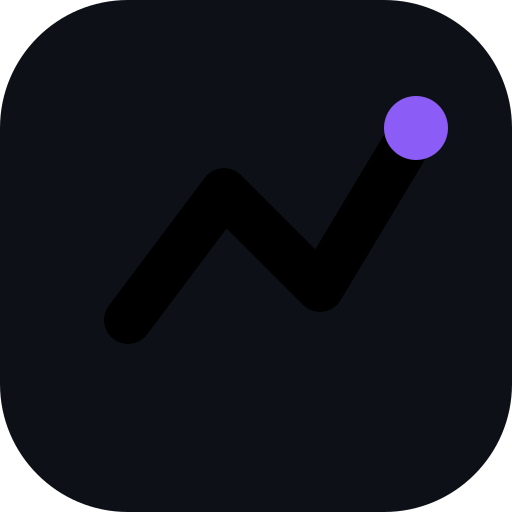

<div align="center">
  
  <h1>WealthPulse</h1>
  <p><strong>A beautifully designed, offline-first Progressive Web App to track your net worth and FIRE goals.</strong></p>
  <p>
    <a href="#features">Features</a> •
    <a href="#getting-started">Getting Started</a> •
    <a href="#tech-stack">Tech Stack</a> •
    <a href="#data-privacy">Data Privacy</a>
  </p>
</div>

<br/>

WealthPulse replaces the traditional, messy "monthly Excel sheet" with a structured, multi-currency financial dashboard. It is built natively for the web but designed to feel like a premium mobile application — install it to your home screen and use it exactly like a native app.

## 🚀 Features

- **Multi-Currency Support** — Add assets and liabilities in their native currencies (USD, EUR, GBP, SGD, AED, INR, etc.). WealthPulse auto-fetches live exchange rates and converts everything to your chosen Base Currency.
- **Live Exchange Rates** — One-click rate refresh via [open.er-api.com](https://open.er-api.com) (free, no API key, 160+ currencies) with [Frankfurter](https://www.frankfurter.app) as fallback. Stale-rate warnings appear automatically when rates are older than 30 days.
- **FIRE Tracking** — Define your Financial Independence target and let the built-in calculator project your Safe Withdrawal Rate and estimated years to retirement based on real net worth growth.
- **Offline-First PWA** — Install directly to your iOS or Android home screen, or use it in any browser. All data is local — zero network required after first load.
- **Glassmorphic Design** — Dark-mode, glassmorphism aesthetic with smooth micro-animations throughout.
- **Data Portability** — Export your full database as a JSON backup. Import historical snapshots from Excel. Auto-safety-backup triggers before any restore operation.

## 💻 Getting Started

### Instant Use (Recommended)

The easiest way to use WealthPulse is to open it in your browser and install it as a PWA:

1. Open the app URL in Chrome, Edge, or Safari
2. Click **"Add to Home Screen"** (Safari on iOS) or **"Install App"** (Chrome/Edge on desktop)
3. Launch from your home screen — it works completely offline from that point forward

### Run Locally

```bash
git clone https://github.com/yourusername/wealthpulse.git
cd wealthpulse
npm install
npm run dev
```

Then open [http://localhost:3000](http://localhost:3000).

### Self-Hosted (Always-On)

For a persistent local server that starts automatically on reboot, use the provided setup scripts:

**macOS:**
```bash
./setup-mac.sh
```

**Linux:**
```bash
./setup-linux.sh
```

**Windows** *(run Command Prompt as Administrator)*:
```cmd
setup-windows.bat
```

These scripts install Node.js if missing, build the production app, and configure PM2 to keep it running on port 3000 permanently.

## 🛠 Tech Stack

| Layer | Technology |
|---|---|
| Framework | [React 18](https://reactjs.org/) + [Vite](https://vitejs.dev/) |
| Language | TypeScript (Strict Mode) |
| Database | [Dexie.js](https://dexie.org/) (IndexedDB wrapper) |
| Styling | Vanilla CSS (CSS Variables, Glassmorphism) |
| Icons | [Lucide React](https://lucide.dev/) |
| Charts | [Recharts](https://recharts.org/) |
| PWA | `vite-plugin-pwa` (Workbox, auto-update) |
| Exchange Rates | [open.er-api.com](https://open.er-api.com) + [Frankfurter](https://api.frankfurter.app) |

## 🛡 Data Privacy

WealthPulse is a strictly **client-side application**. It has no backend, no authentication servers, and sends zero telemetry.

All financial data is stored locally on your device inside your browser's **IndexedDB** database.

> ⚠️ **On-device security:** IndexedDB files are stored **unencrypted** on disk. On a shared computer, ensure your device has full-disk encryption enabled — [FileVault](https://support.apple.com/en-us/102541) on macOS or [BitLocker](https://learn.microsoft.com/en-us/windows/security/information-protection/bitlocker/bitlocker-overview) on Windows.

**Backups:** The JSON export feature creates a **plaintext** backup file. Treat it like any sensitive document — store it in an encrypted location (password-protected zip, encrypted cloud folder like [Cryptomator](https://cryptomator.org/), etc.).

## 📄 License

This project is licensed under the MIT License — see the [LICENSE](./LICENSE) file for details.
