# WealthPulse — User Guide

WealthPulse is a privacy-first, offline net worth tracker that runs entirely in your browser. No accounts, no servers — your data stays on your device.

---

## Table of Contents

1. [Getting Started](#1-getting-started)
2. [Creating & Editing Snapshots](#2-creating--editing-snapshots)
3. [Dashboard](#3-dashboard)
4. [History](#4-history)
5. [Goals & FIRE Planning](#5-goals--fire-planning)
6. [Portfolio View](#6-portfolio-view)
7. [Settings](#7-settings)
8. [Automated Backup](#8-automated-backup)
9. [Mobile Experience](#9-mobile-experience)
10. [Light Mode](#10-light-mode)
11. [Keyboard Shortcuts & Tips](#11-keyboard-shortcuts--tips)
12. [Frequently Asked Questions](#12-frequently-asked-questions)

---

## 1. Getting Started

When you open WealthPulse for the first time you'll see the welcome screen. No login required.

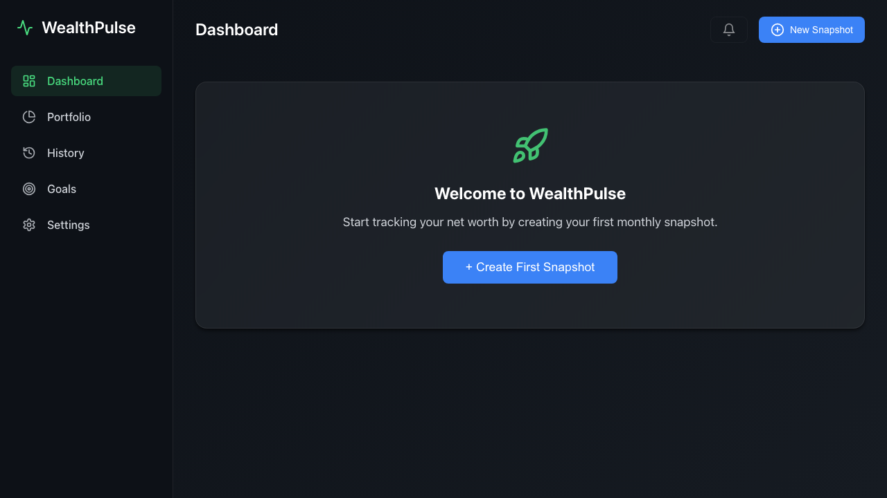

Click **+ Create First Snapshot** to create your first monthly net worth snapshot. WealthPulse organises your finances by month — one snapshot = one month's picture of your wealth.

---

## 2. Creating & Editing Snapshots

### Empty snapshot editor

After clicking the CTA (or **New Snapshot** in the header), the snapshot editor opens:

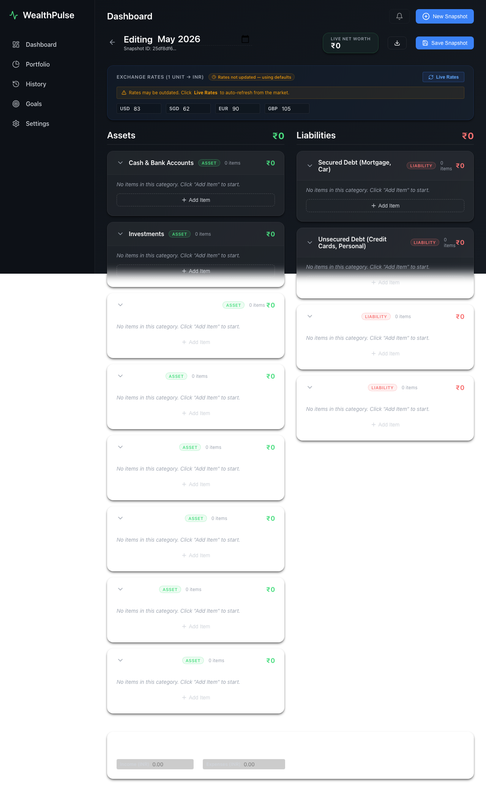

The editor has two panels:
- **Assets** — everything you own (savings, investments, property, …)
- **Liabilities** — everything you owe (loans, credit cards, …)

Your **net worth** is calculated live as `Assets − Liabilities`.

### Adding line items

Click the **+** button inside any category panel to add a row. Type a name and an amount:

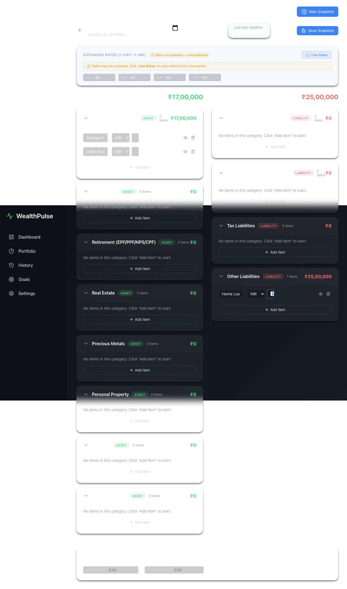

| Action | How |
|---|---|
| Add item | Click **+** in the category header |
| Remove item | Click the **×** on the right of the row |
| Edit amount | Click the amount field and type |
| Change month | Click the month in the editor header (e.g. `2024-03`) and type or pick a date |

> **Tip:** You can edit the month date to create historical snapshots — useful if you are backfilling data.

### Saving

Click **Save Snapshot** to persist your data and return to the dashboard. The editor auto-warns if you try to leave with unsaved changes.

### Creating the next month

From the dashboard, click **New Month**. WealthPulse pre-fills the next calendar month and copies your previous asset/liability structure, so you only need to update the amounts.

---

## 3. Dashboard

The dashboard is your central view. It updates automatically every time you save a snapshot.

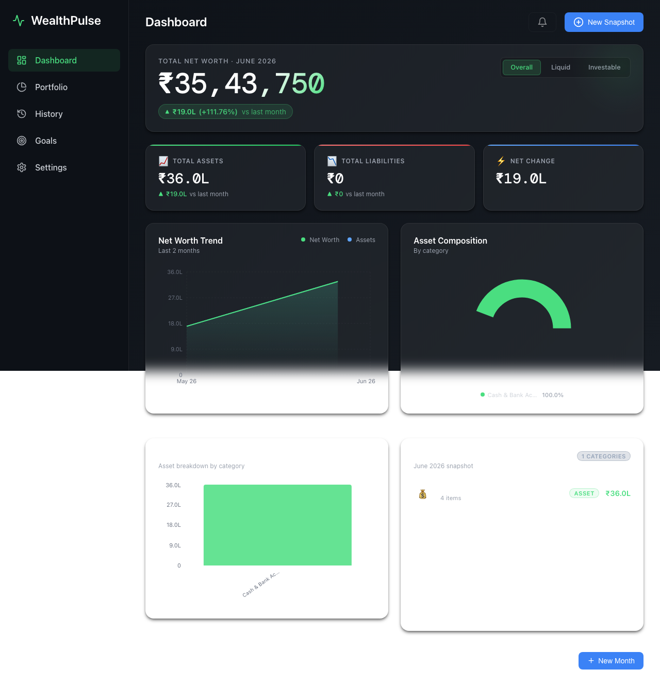

### Net Worth Hero

The large figure at the top shows your **current net worth** with a month-over-month change indicator (green = up, red = down).

The three toggle buttons — **Overall / Assets / Liabilities** — switch what the hero figure and the trend chart display.

### Metric Cards

Below the hero you'll find four summary cards:
| Card | Meaning |
|---|---|
| Total Assets | Sum of all asset line items for the current month |
| Total Liabilities | Sum of all liability line items |
| Asset/Liability Ratio | Assets ÷ Liabilities — higher is better |
| Monthly Change | Net worth difference vs. the previous month |

### Trend Chart

The line chart shows your net worth over time. Switch between Overall / Assets / Liabilities using the hero toggle.

### Donut Chart

The donut breaks down your assets by **category** (e.g. Savings, Investments, Property). Hover a segment for the value.

### Performance Chart

The bar chart shows month-over-month **percentage change** — a quick way to spot your best and worst months.

### Exchange Rate Bar

If you hold foreign-currency assets, the rate bar shows live exchange rates against your base currency. Rates are fetched automatically; you can also type a manual rate by clicking the pencil icon.

---

## 4. History

The History page shows every snapshot you have ever saved.

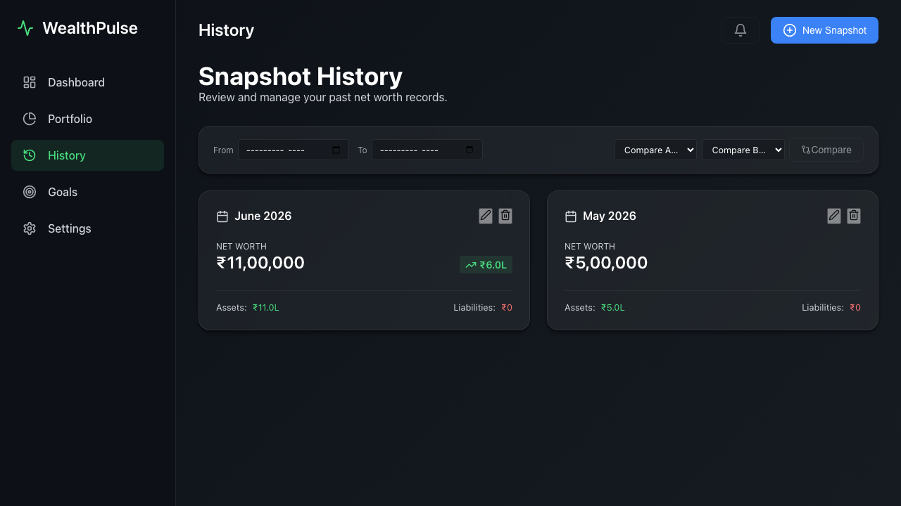

### Browsing snapshots

Each card shows the month, total assets, total liabilities, and net worth for that period. Click a card to open it in the editor.

### Filtering by date range

Use the two **month** pickers at the top to narrow the view. A filter badge appears when a filter is active. Click **Clear** to reset.

### Deleting a snapshot

Click the **trash** icon on a card. A destructive confirmation dialog appears — you must confirm before the data is removed.

### Comparing two snapshots

Check the checkbox on two cards then click the **Compare** button that appears. A side-by-side diff shows every line item and its change between the two months.

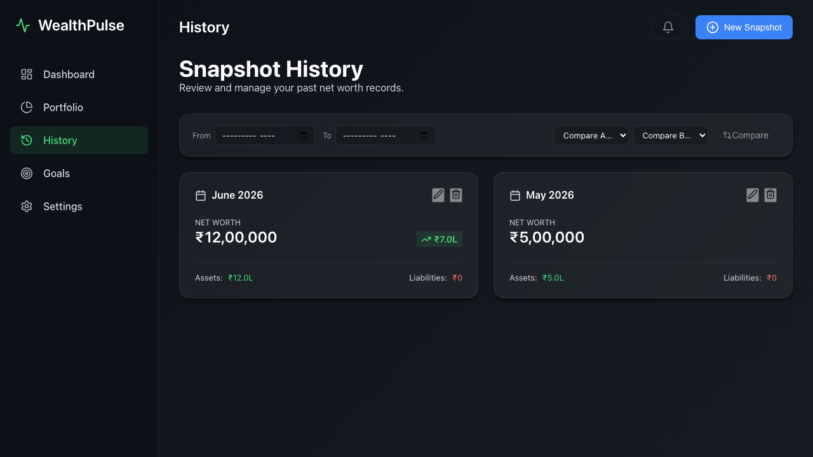

---

## 5. Goals & FIRE Planning

WealthPulse has a dedicated Goals engine with two goal types.

### Empty state

When you have no goals yet, the Goals page shows a prompt:

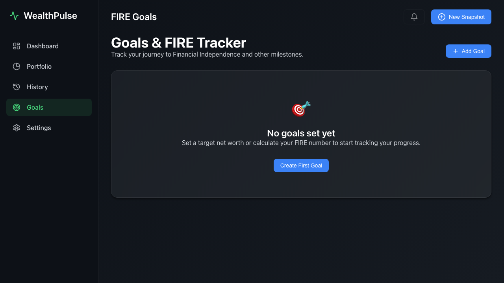

Click **Add Goal** to open the goal creation modal.

### Goal types

| Type | When to use |
|---|---|
| **FIRE** | You want to retire early. The engine calculates your FIRE number from annual expenses and tracks your progress. |
| **Net Worth Target** | You have a specific number in mind (e.g. ₹1 Crore). |

### Creating a FIRE goal

1. Click **Add Goal**
2. Enter a name (e.g. "Early Retirement")
3. Enter your **annual expenses** — WealthPulse multiplies by 25 (the 4% rule) to calculate your FIRE number
4. Optionally add milestones (e.g. 25%, 50%, 75%)
5. Click **Save Goal**

### FIRE Dashboard

Once saved, the FIRE dashboard appears:

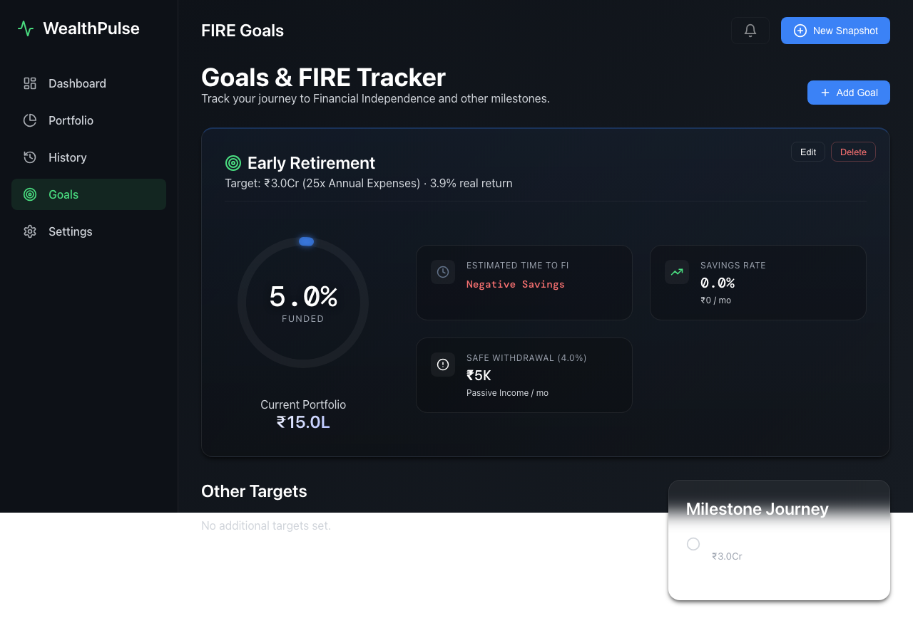

- **Progress ring** — shows what percentage of your FIRE number you've reached
- **Projected date** — based on your average monthly savings rate
- **Safe withdrawal rate** — dynamically calculated from your current net worth
- **Milestones** — custom checkpoints shown as markers on the progress ring

### Editing & deleting goals

Click the **edit** (pencil) icon to modify a goal. Click the **delete** (trash) icon — a destructive confirm dialog prevents accidents.

---

## 6. Portfolio View

The Portfolio page lists all your individual assets in a sortable table.

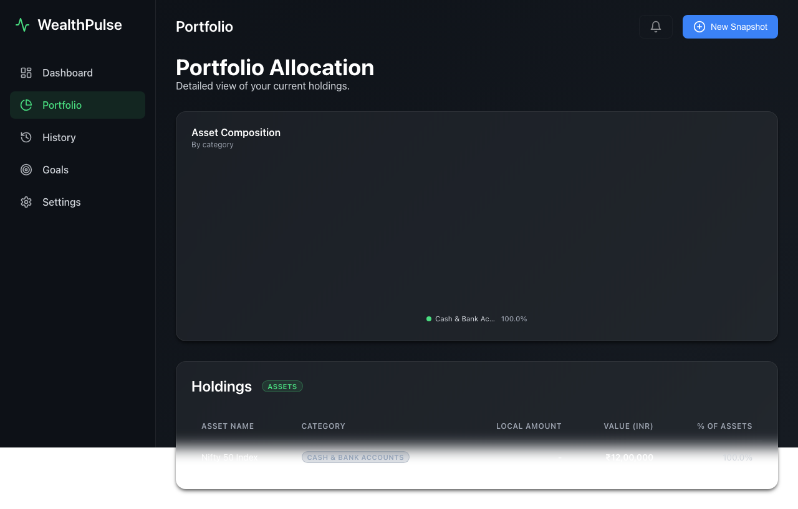

You can sort by name, amount, category, or percentage of total assets. Use this view to quickly identify your largest holdings or rebalance allocation.

---

## 7. Settings

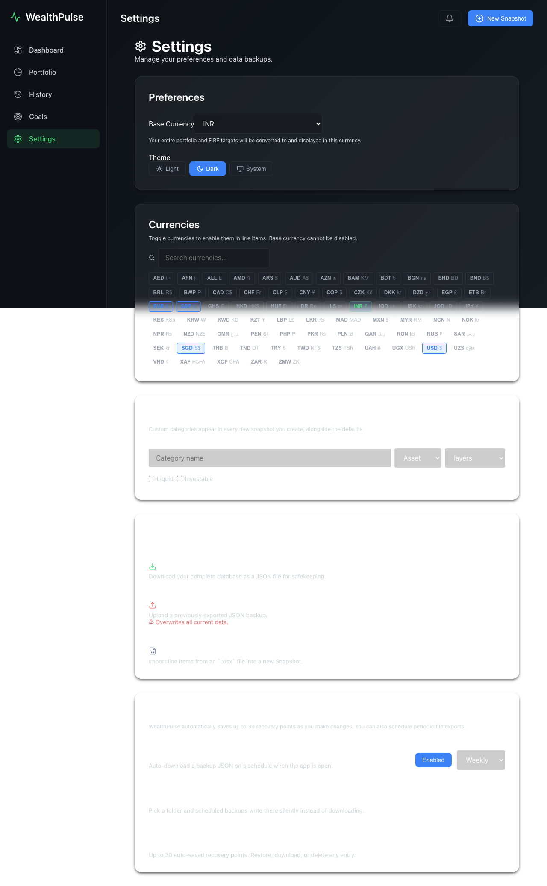

### Preferences

| Setting | Description |
|---|---|
| **Base Currency** | The currency used for all totals and calculations |
| **Theme** | Light or Dark |
| **Enabled Currencies** | Search and toggle currencies for exchange-rate display |

### Custom Categories

By default WealthPulse ships with standard asset and liability categories. You can:
- **Add** a new category by typing a name and clicking **Add**
- **Rename** a category by clicking the pencil icon inline
- **Delete** a category with the trash icon (only custom categories can be deleted)

### Data Management

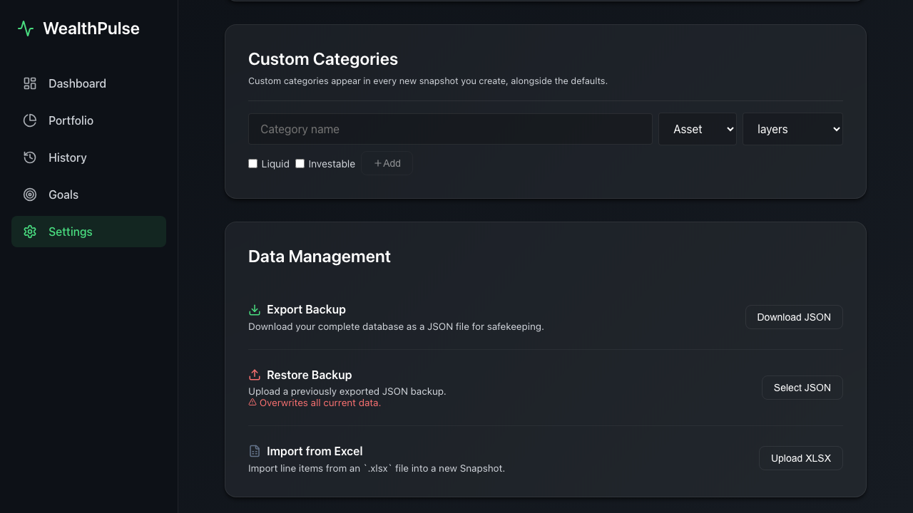

| Action | Description |
|---|---|
| **Download JSON** | Exports your full data as a portable JSON file |
| **Import JSON** | Restores data from a previously exported file |

> **Important:** Import replaces all current data. WealthPulse automatically downloads a safety backup before any import completes.

---

## 8. Automated Backup

WealthPulse has three independent backup layers to protect your data.

### Layer 1 — In-app rolling backups

Every time you save a snapshot, update a goal, or change preferences, WealthPulse automatically stores a full backup in your browser's IndexedDB. Up to **30 backups** are kept in a ring buffer (oldest is dropped after 30).

In Settings → Auto-Backup you can:
- Toggle backups **Enabled / Disabled**
- Click **Save Now** for an immediate manual backup
- Click **Show History** to see all stored backups with timestamps
- **Restore** any backup (a safety download fires first)
- **Download** any backup as a JSON file
- **Delete** individual backup entries

### Layer 2 — Scheduled file export

Set a **cadence** (Daily / Weekly / Monthly) and WealthPulse will automatically download a `wealthpulse-backup-YYYY-MM-DD.json` file while the app is open.

### Layer 3 — Backup folder (Chrome/Edge only)

Click **Pick Backup Folder** to choose a directory on your computer. All scheduled backups will be written silently to that folder. If permission expires, WealthPulse falls back to a regular download and shows a toast notification.

---

## 9. Mobile Experience

WealthPulse is fully responsive and works on phones and tablets.

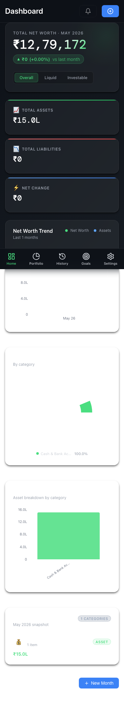

### Mobile navigation

A bottom navigation bar provides one-tap access to all five sections:

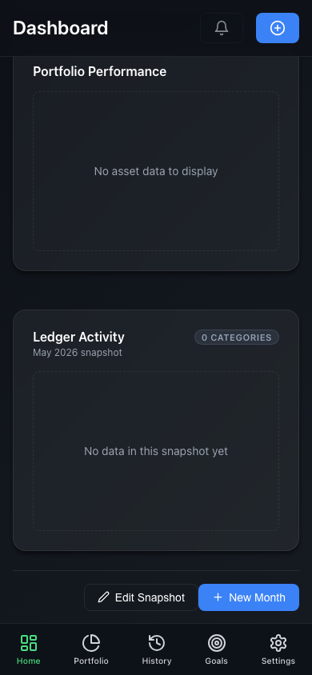

| Tab | Page |
|---|---|
| Home | Dashboard |
| Portfolio | Portfolio |
| History | History |
| Goals | Goals |
| Settings | Settings |

---

## 10. Light Mode

Switch to Light mode in **Settings → Preferences → Theme**:

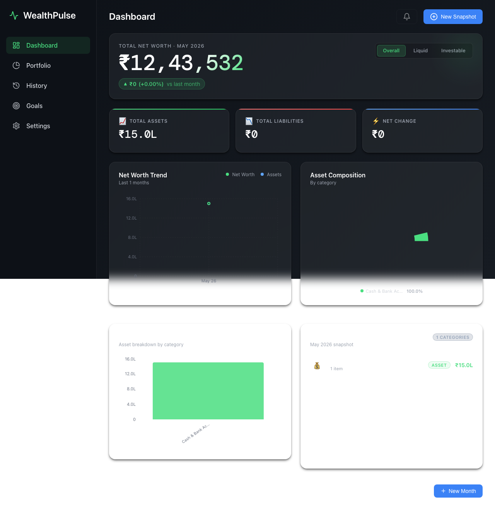

The theme preference is saved locally and persists across sessions.

---

## 11. Keyboard Shortcuts & Tips

| Shortcut / Tip | Effect |
|---|---|
| **Escape** | Close any open modal |
| **Enter** (in rename input) | Confirm category rename |
| **Tab** | Move between line item fields |
| Month input in editor | Click the month header to edit; supports `YYYY-MM` format |
| Duplicate month guard | If you try to save a snapshot for an existing month, an error toast prevents overwriting |
| Exchange rate lock | Click the lock icon to freeze a rate so it doesn't update on the next fetch |

---

## 12. Frequently Asked Questions

**Does WealthPulse send my data anywhere?**
No. All data is stored in your browser's IndexedDB. The only external request is the optional live exchange rate fetch from `open.er-api.com` / `frankfurter.app`.

**Can I use it offline?**
Yes. WealthPulse is a Progressive Web App (PWA). After the first load, it works fully offline. Install it from your browser's address bar for a native-app-like experience.

**How do I install it as an app?**
In Chrome/Edge, look for the **install** icon in the address bar (⊕ or a screen icon). On Safari/iOS, tap **Share → Add to Home Screen**.

**What happens if I clear my browser data?**
Your data will be lost unless you have an export or auto-backup. Use **Download JSON** regularly, or enable the scheduled export to keep backups automatically.

**Can I move data between devices?**
Yes — export on one device (**Download JSON**), then import on the other (**Import JSON** in Settings).

**How is my FIRE number calculated?**
FIRE number = Annual expenses × 25 (the standard 4% safe withdrawal rate rule). You can adjust the multiplier in the goal editor.

**I accidentally deleted a snapshot. Can I recover it?**
If auto-backup was enabled, go to Settings → Auto-Backup → Show History and restore the most recent backup taken before the deletion.

---

*WealthPulse — built for privacy, designed for clarity.*
